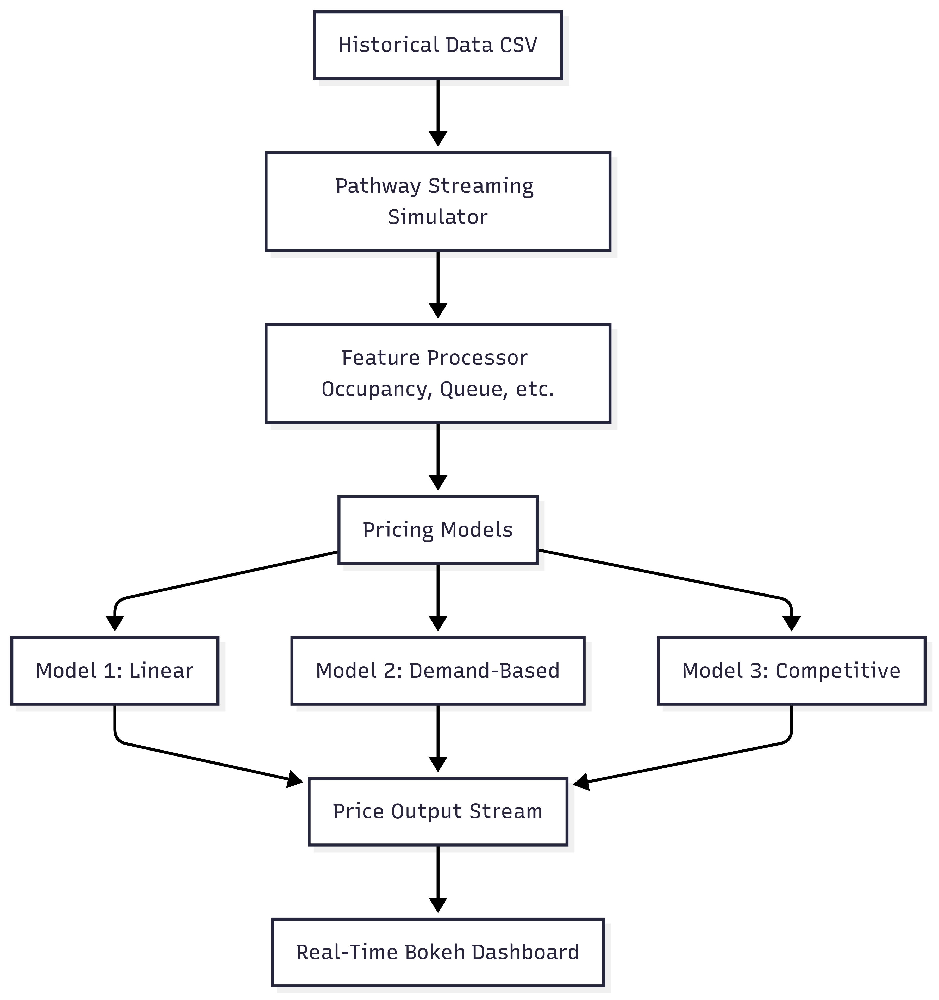

# 🚗 Dynamic Pricing for Urban Parking Lots

**Capstone Project - Summer Analytics 2025**  
Hosted by Consulting & Analytics Club x Pathway

---

## 🧾 Overview

This project implements a **dynamic pricing system** for 14 urban parking lots using real-time data such as occupancy, queue length, traffic congestion, and vehicle types. Traditional static pricing often results in underutilization or overbooking of spaces. Our solution uses real-time streaming data and machine learning models-built from scratch using only `pandas`, `numpy`, and `Pathway`-to continuously update parking prices in a smooth, explainable manner.

---

## 🛠 Tech Stack

| Component      | Tool/Library       | Purpose                              |
|----------------|--------------------|--------------------------------------|
| Programming    | Python             | Core language                        |
| Data Handling  | Pandas, Numpy      | Preprocessing and feature creation   |
| Real-Time Ingestion | Pathway      | Stream processing simulation         |
| Visualization  | Bokeh              | Real-time pricing plots              |
| Execution      | Google Colab       | Development and execution            |
| Version Control| GitHub             | Collaboration and repository hosting |

---

## 📐 Architecture Diagram

```mermaid
flowchart TD
    A[Historical Data (CSV)] --> B[Pathway Streaming Simulator]
    B --> C[Feature Processor (Occupancy, Queue, etc.)]
    C --> D[Pricing Models]
    D --> E[Model 1: Linear]
    D --> F[Model 2: Demand-Based]
    D --> G[Model 3: Competitive]
    E & F & G --> H[Price Output Stream]
    H --> I[Real-Time Bokeh Dashboard]
```


---

## 🔄 Pricing Models & Logic

### ✅ Model 1 - Linear Pricing

- Price increases linearly with occupancy.
- `Price(t+1) = Price(t) + α × (Occupancy / Capacity)`

### ✅ Model 2 - Demand-Based Pricing

- Factors: occupancy rate, queue length, traffic level, special days, vehicle type.
- `Price = Base × (1 + λ × NormalizedDemand)`

### ✅ Model 3 - Competitive Model

- Includes proximity-based competitor price comparisons.
- Uses geolocation (lat/long) to determine nearby parking lots and adjusts price accordingly.

---

## 📂 Repository Structure

```
📁 dynamic-parking-pricing/
├── dataset.csv                # Raw data file with features
├── notebook.ipynb             # Google Colab notebook with all code
├── problem statement.pdf      # Official challenge document
├── visualizations            # Bokeh HTML plots
├── architecture.png           # Visual version of the architecture
└── README.md                  # This file

---

## ▶️ How to Run

1. Clone the repository or download as ZIP:
   ```bash
   git clone https://github.com/UzwalaManasa/dynamic-parking-pricing.git
   ```
2. Open `notebook.ipynb` by opening the link `https://colab.research.google.com/drive/1LzS2c-KBOcyTGiynJu5LRi2enTwBdob6?usp=sharing` in Google Colab or any browser.
3. Upload `dataset.csv` when prompted.
4. Run all cells to:
   - Preprocess data
   - Simulate real-time prices using Pathway
   - Visualize price trends via Bokeh

---

## 📊 Visualization

- Live line plots of parking lot prices.
- Side-by-side comparison with nearby competitors.
- Trends over the day (e.g., peak hours vs idle times).
- HTML Files: price_trends.html
              competitive_pricing.html
Open `visualisations.ipynb` in Google Colab.

---

## 📃 Documentation

- [Problem Statement](./problem%20statement.pdf)
- [Pathway Streaming Guide](https://pathway.com/developers/user-guide/introduction/first_realtime_app_with_pathway/)

---

## ✅ Requirements Fulfilled

✔ Linear, demand-based, and competitive pricing logic  
✔ Real-time simulation via Pathway  
✔ Real-time visualizations using Bokeh  
✔ Fully working code in Colab  
✔ Public GitHub repository with all files  

---

## Submitted by-

- [Maaroju Uzwala Manasa]

---

## 📬 Contact

For queries, email: [uzwalamanasa@gmail.com]
             contact: 7989862230
